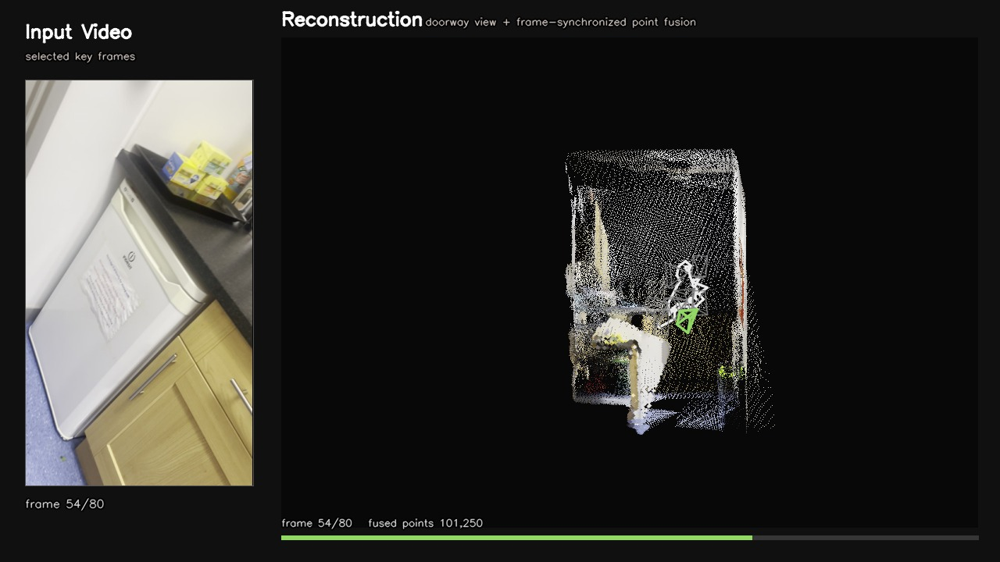
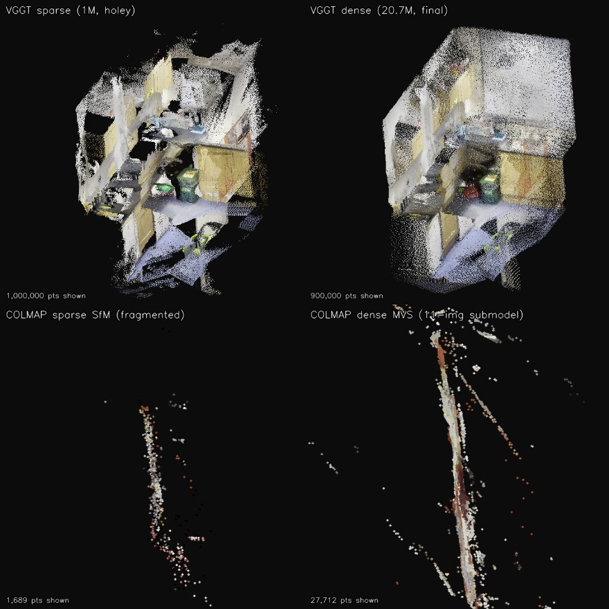
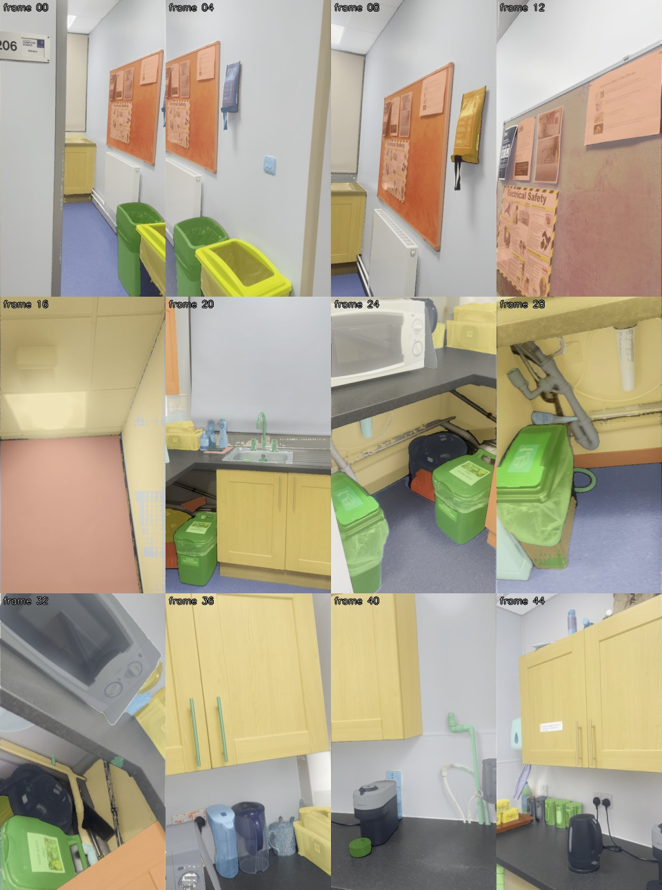
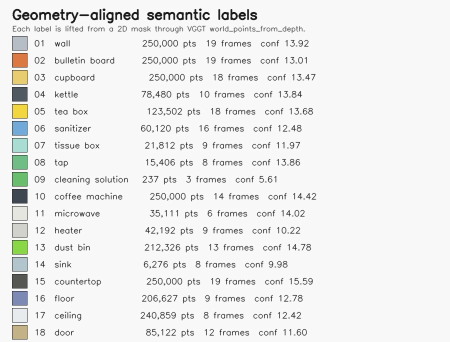
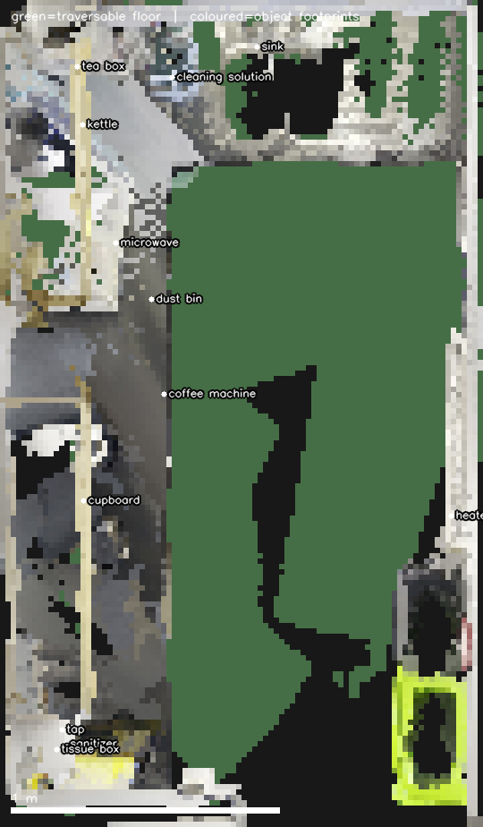
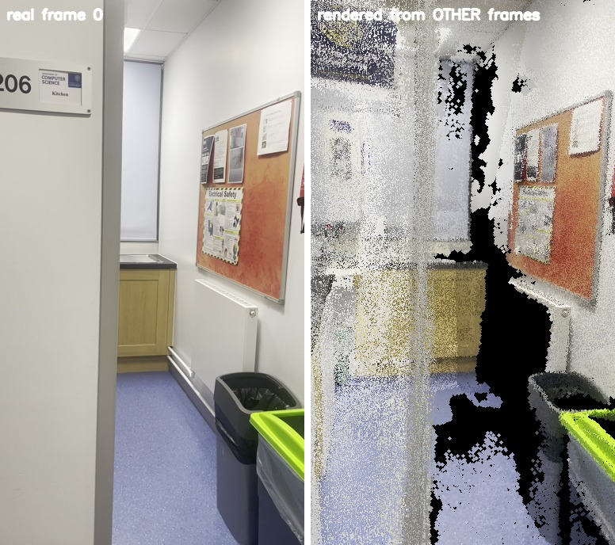

# Phone2Room3D — Video to 3D Reconstruction

[](https://github.com/fanqixucs/Phone2Room3D/actions/workflows/ci.yml)

This project reconstructs a small indoor 3D scene from a single hand-held **phone video** and
adds **open-vocabulary semantic understanding** on top of the geometry. Geometry comes from a
single feed-forward pass of **VGGT-Omega-1B-512**; everything else in this repository is the
pipeline, evaluation, and robotics-facing exports built around it.

[](outputs/kitchen_small_room_vggt_omega_1b_512/visceral_demo_flythrough.mp4)

> ▶️ **[Watch the point-of-view flythrough (MP4)](outputs/kitchen_small_room_vggt_omega_1b_512/visceral_demo_flythrough.mp4)** — the virtual camera follows the estimated trajectory and renders the dense cloud from each frame's point of view, so the reconstruction panel mirrors what the phone saw while the scene builds up. (Preview image above.)

---

## 30-second reviewer path

**1. Skim the committed outputs** (no run needed):

- Flythrough — [`outputs/.../visceral_demo_flythrough.mp4`](outputs/kitchen_small_room_vggt_omega_1b_512/visceral_demo_flythrough.mp4)
- Dense 3D reconstruction — [`outputs/.../pointcloud_full.ply`](outputs/kitchen_small_room_vggt_omega_1b_512/pointcloud_full.ply) (20.7M points; open in MeshLab / CloudCompare), or the lighter browser-viewable [`scene.glb`](outputs/kitchen_small_room_vggt_omega_1b_512/scene.glb)
- BEV + object anchors — [`outputs/.../scene_analysis/`](outputs/kitchen_small_room_vggt_omega_1b_512/scene_analysis/)
- Semantic map — [`outputs/.../semantics/`](outputs/kitchen_small_room_vggt_omega_1b_512/semantics/)

**2. Run without GPU or checkpoint** (~45 s — imports + analysis on committed data):

```bash
bash scripts/smoke_test.sh
```

**3. Full reconstruction** (needs a CUDA GPU + the VGGT-Omega checkpoint):

```bash
git lfs pull
export VGGT_OMEGA_ROOT=/path/to/vggt-omega
export VGGT_OMEGA_CHECKPOINT=/path/to/vggt_omega_1b_512.pt
bash scripts/run_kitchen.sh
```

> **Runtime:** the VGGT pass uses **~15.5 GB GPU memory** and **~18 s for 80 frames** on an RTX A6000 (measured) — any ≥16 GB CUDA GPU is comfortable. Step 2 needs neither GPU nor checkpoint. Full setup is in [Section 3](#3-how-to-run).

## What I built beyond the backbone

VGGT-Omega supplies only the raw geometry (depth, pose, intrinsics). Everything below is this repo:

- Robust phone-video **orientation canonicalization** (the iPhone `.MOV` display-rotation fix).
- VGGT depth/pose/intrinsics **export into PLY/GLB** in a shared world frame.
- **Dense point-cloud + first-person flythrough renderer** (surfel splatting, enclosed-hole inpainting).
- **COLMAP baseline** on the same extracted frames (classical SfM + dense MVS).
- **ScanNet GT validation** for pose / depth / unprojection correctness.
- **No-ground-truth coherence metrics** for the phone video.
- Open-vocabulary **2D → 3D semantic lifting**.
- **Gravity alignment, metric scale anchoring, BEV traversability, and object-anchor JSON** for robotics use.

---

## Contents

- [30-second reviewer path](#30-second-reviewer-path) · [What I built beyond the backbone](#what-i-built-beyond-the-backbone)

1. [Challenge Checklist](#1-challenge-checklist)
2. [System Design & Code Structure](#2-system-design--code-structure)
3. [How to Run](#3-how-to-run)
4. [Example Outputs](#4-example-outputs)
5. [Evaluation System](#5-evaluation-system)
6. [Design Choices & Trade-offs](#6-design-choices--trade-offs)
7. [Failure Cases](#7-failure-cases)
8. [Scale Analysis](#8-scale-analysis)
9. [Future Work — HMND-01 Alpha](#9-future-work--hmnd-01-alpha)
10. [License](#10-license)

---

## 1. Challenge Checklist

| Requirement | Where it is satisfied |
|---|---|
| Generate a 3D representation from video | `pointcloud.ply` (8M), `pointcloud_full.ply` (20.7M), `scene.glb` from `scripts/run_kitchen.sh` |
| Geometrically coherent and consistent | `no_gt_eval_metrics.json`, ScanNet GT evaluation, gravity-aligned plane sanity, held-out novel-view PSNR/SSIM |
| Working codebase | `src/video_to_3d`, scripts under `scripts/` |
| Clear run instructions | [Section 3 — How to Run](#3-how-to-run) (build env → run → analyses → smoke test) |
| Example input/output | kitchen phone video, ScanNet `scene0000_00`, COLMAP baseline, outputs under `outputs/` |
| Semantic labels in 3D | `semantics/semantic_pointcloud*.ply`, `semantic_labeled_viewer.html`, `semantic_labeled_points.npz` |
| Semantics aligned with geometry | labels lifted from 2D masks through VGGT `world_points_from_depth`; semantic PLY shares the geometry coordinate frame |
| Compelling presentation | point-of-view flythrough `visceral_demo_flythrough.mp4`, browser player, BEV map, object-anchor JSON |

---

## 2. System Design & Code Structure

The pipeline is **video → frames → VGGT-Omega → unproject → fuse → export → evaluate**, with an
optional semantic stage and robotics-facing exports.

### 2.0 Data orientation (the first real bug)

iPhone `.MOV` files store a display-rotation transform separately from the raw sensor raster.
OpenCV ignores it and returns frames **sideways**, which silently corrupts every downstream pose.
Frame extraction therefore uses **ffmpeg** when available so the QuickTime display metadata is
applied *before* frames reach VGGT-Omega. Evidence: an upright `contact_sheet.jpg` and a VGGT
tensor that matches the displayed portrait video, `(80, 3, 688, 384)`. This is input
canonicalization, not pose estimation.

### 2.1 Keyframe selection / data curation

The 80.3 s clip is sampled to **80 frames** (`--sample-fps 1.0`, see `video.py`). A short static
indoor clip does not need dense sampling; one frame per second gives enough parallax for
VGGT-Omega while keeping the feed-forward pass cheap. Frames are written upright to
`outputs/.../frames/` and reused by both the VGGT path and the COLMAP baseline so the comparison
is fair.

### 2.2 Backbone geometry — VGGT-Omega vs. COLMAP

**VGGT-Omega-1B-512** (`vggt_runner.py`) consumes all 80 frames in **one feed-forward pass** and
returns per-frame depth, camera poses, intrinsics, and confidence. Depth is unprojected into a
shared world frame (`export.py`) and fused into point clouds.

For a classical baseline we ran **COLMAP 3.8 (CUDA)** SfM + dense MVS on the *same* 80 frames
(`scripts/run_colmap_kitchen.sh`). The result is the most informative single experiment in the
repo:

| | VGGT-Omega-1B-512 | COLMAP (SfM + MVS) |
|---|---|---|
| Frames used | **80 / 80** in one connected model | registered into **2 disconnected models** (11 + 69 images) — never fused into one |
| Sparse points | dense by construction | 1,689 (model 0) + 8,094 (model 1) |
| Dense points | **20,712,652** | **27,712** (dense MVS on the 11-image submodel) |
| Runtime | one ~seconds GPU pass | feature + match + map + MVS minutes, and still fragments |

So the user's intuition — "*it's a small static room, COLMAP shouldn't look that bad*" — is
empirically **false here**: low-texture walls, repeated cabinet fronts, and a small baseline break
feature matching, so COLMAP cannot register the sequence into a single consistent map and the dense
MVS covers only a fragment. The learned geometric prior in VGGT-Omega is exactly what overcomes
this. See the side-by-side in [Section 4](#4-example-outputs).

### 2.3 Filling the holes

Early exports were holey because only 1M points survived aggressive confidence/edge filtering.
Three changes fixed visualization without hiding bad geometry:

- **Dense PLY export** — low confidence percentile, no edge pruning: `pointcloud.ply` (8M) and a
  full-density `pointcloud_full.ply` (**20.7M**).
- **Flythrough renderer** (`reconstruction_player.py`, `--mode flythrough`) — perspective surfel
  **splatting** (depth-scaled disks) so near surfaces read as solid sheets, **near-first-person**
  camera so sparse side-floaters fall out of view, statistical floater culling, and
  **connected-component inpainting** that closes geometry-enclosed gaps (e.g. the sparsely sampled
  ceiling) while leaving true doorway/window voids black.
- The flythrough uses **every point** of `pointcloud_full.ply` so the video matches the offline
  PLY quality.

### 2.4 Semantic understanding

`semantics.py`: GroundingDINO open-vocabulary detection → SAM masks → lift mask pixels into 3D
through `world_points_from_depth` → export a semantic PLY in the **same** first-camera-aligned
frame as the geometry. 18 classes, **2,378,070** semantic points, each carrying source frame,
source pixel, depth confidence, and semantic id.

### Code structure

```text
src/video_to_3d/
  cli.py                 # end-to-end entry point (video -> outputs)
  video.py               # ffmpeg/OpenCV frame extraction (orientation fix)
  vggt_runner.py         # VGGT-Omega-1B-512 wrapper
  export.py              # unproject depth, PLY/GLB export, alignment
  semantics.py           # GroundingDINO + SAM -> 3D semantic lifting
  metrics.py             # pose/Chamfer/depth/feature/plane metrics
  evaluate_scannet.py    # ScanNet GT benchmark
  evaluate_no_gt.py      # no-ground-truth coherence gates
  scene_analysis.py      # NEW: gravity frame, metric scale, plane sanity, object anchors, BEV
  novel_view.py          # NEW: held-out novel-view PSNR/SSIM
  reconstruction_player.py / visceral_demo.py  # flythrough renderer + browser player
  report.py
scripts/
  run_kitchen.sh, run_kitchen_semantics.sh, evaluate_kitchen_no_gt.sh,
  evaluate_scannet_scene0000.sh, make_visceral_demo.sh,
  run_colmap_kitchen.sh  # NEW: COLMAP SfM + dense MVS baseline
  render_cloud_views.py  # NEW: fixed-view PLY renders for comparisons
```

---

## 3. How to Run

Everything runs in a single conda environment you build below — there is no dependency on any
pre-existing local environment.

### 1. Build the environment

```bash
git clone https://github.com/fanqixucs/Phone2Room3D.git && cd Phone2Room3D
git lfs pull                                             # demo artifacts (.ply/.npz/.glb/.MOV/.mp4)
git clone https://github.com/facebookresearch/vggt-omega.git ../vggt-omega

conda create -n phone2room3d python=3.10 -y
conda activate phone2room3d
# install a CUDA-enabled PyTorch build matching your driver FIRST, then:
pip install -r requirements.txt        # or: pip install -r requirements-lock.txt (pinned)
pip install -e ../vggt-omega
pip install -e .
```

> **Hardware / runtime.** The VGGT-Omega forward pass uses **~15.5 GB peak GPU memory** and takes
> **~18 s for 80 frames** on an RTX A6000 (measured). A CUDA GPU with **≥16 GB** is recommended for
> reconstruction; the analyses and `scripts/smoke_test.sh` run CPU-only. `requirements-lock.txt`
> pins the exact tested versions (Python 3.10, torch 2.9, open3d 0.19); install your CUDA-matched
> PyTorch build first.

Also install **ffmpeg** (`conda install -c conda-forge ffmpeg` or a system package) — preferred
because it honors phone display-orientation metadata before frames reach VGGT-Omega. Download the
gated **VGGT-Omega-1B-512** checkpoint and point the environment at it:

```bash
export VGGT_OMEGA_ROOT=/path/to/vggt-omega
export VGGT_OMEGA_CHECKPOINT=/path/to/vggt_omega_1b_512.pt
export VIDEO_PATH=data/kitchen_small_room.MOV
```

### 2. Run the pipeline

With `phone2room3d` activated, run the scripts directly (no per-command env prefix):

```bash
bash scripts/run_kitchen.sh            # geometry + PLY/GLB
bash scripts/run_kitchen_semantics.sh  # 3D semantic labels
bash scripts/evaluate_kitchen_no_gt.sh # no-GT coherence gates
bash scripts/make_visceral_demo.sh     # flythrough MP4 + browser player
```

Run on your own video instead:

```bash
python -m video_to_3d.cli --video /path/to/video.MOV --vggt-root "$VGGT_OMEGA_ROOT" --checkpoint "$VGGT_OMEGA_CHECKPOINT"
```

### 3. Run the analyses

```bash
python -m video_to_3d.scene_analysis --run-dir outputs/kitchen_small_room_vggt_omega_1b_512  # scale / planes / anchors / BEV
python -m video_to_3d.novel_view    --run-dir outputs/kitchen_small_room_vggt_omega_1b_512  # held-out PSNR/SSIM
```

Optional classical baseline, in a **separate** COLMAP env so it never touches the main one:

```bash
conda create -n colmap -c conda-forge colmap   # CUDA build; on older-glibc hosts use colmap=3.8
COLMAP_ENV=colmap bash scripts/run_colmap_kitchen.sh
```

Main output folder: `outputs/kitchen_small_room_vggt_omega_1b_512`.

### Smoke test

Before (or after) a full run, verify the checkout end-to-end. Two levels, both in the activated
`phone2room3d` env:

```bash
# Fast (~45 s, no checkpoint/GPU needed): imports + scene analysis + novel-view on the
# committed kitchen outputs, then asserts the artifacts were written.
bash scripts/smoke_test.sh

# Deeper: exercise the VGGT-Omega wiring and checkpoint load without a full inference.
bash scripts/dry_run.sh
```

A passing smoke test prints `SMOKE TEST PASSED` and confirms `scene_analysis/object_anchors.json`,
`scene_analysis/bev_traversability.png`, and `novel_view/novel_view_metrics.json` were regenerated.
It is the quickest way to confirm a checkout (after `git lfs pull`) is wired correctly.

---

## 4. Example Outputs

### 4.1 Geometric output (graphic-flavored)

The same scene reconstructed two ways, rendered from the same kind of 3/4 overview:



| Stage | VGGT-Omega | COLMAP |
|---|---|---|
| Rudimentary / sparse | 1M ordered sample — already a recognizable room | sparse SfM: 1,689 + 8,094 pts across two disconnected maps |
| Holes | confidence/edge filtering left grazing-angle gaps | most frames simply fail to register |
| Final | **20.7M** dense points, one consistent room | dense MVS: **27,712** pts on an 11-image fragment |

Semantic understanding (lifted through VGGT geometry, same coordinate frame):





| Class | 3D points | Class | 3D points | Class | 3D points |
|---|--:|---|--:|---|--:|
| wall | 250,000 | countertop | 250,000 | dust bin | 212,326 |
| cupboard | 250,000 | ceiling | 240,859 | floor | 206,627 |
| coffee machine | 250,000 | bulletin board | 250,000 | tea box | 123,502 |
| door | 85,122 | kettle | 78,480 | sanitizer | 60,120 |
| heater | 42,192 | microwave | 35,111 | tissue box | 21,812 |
| tap | 15,406 | sink | 6,276 | cleaning solution | 237 |

### 4.2 Robotics output (robot-flavored)

A reconstruction is only useful to a robot if it is **metric, gravity-aligned, and segmented into
objects with poses**. Two artifacts are produced by `scene_analysis.py`.

**Bird's-eye-view / traversability map** — top-down occupancy, traversable floor in green, object
footprints colored by semantic class, 1 m scale bar:



**Object-anchor JSON** (`scene_analysis/object_anchors.json`) — a manipulation/navigation stack
can consume this directly. Each entry has a metric centroid, an axis-aligned box, and a base
height above the floor (gravity frame, metres):

| Object | size (x×y×h, m) | base above floor (m) |
|---|---|--:|
| microwave | 0.28 × 0.42 × 0.23 | 0.93 (on the worktop) |
| dust bin | 0.32 × 0.20 × 0.43 | 0.06 (on the floor) |
| kettle | 0.33 × 0.35 × 0.12 | on the worktop |
| sink | 0.40 × 0.43 × 0.06 | 0.85 |
| tap | 0.32 × 0.15 × 0.03 | 0.91 |

Discrete objects use their dominant DBSCAN cluster so scattered open-vocabulary false positives do
not inflate the box.

---

## 5. Evaluation System

Two complementary evaluators answer two different questions. The phone room has **no ground
truth**, so before trusting *any* number on it we first prove the **pipeline itself is correct** on
data that does have GT (ScanNet). Only then do we apply a **no-ground-truth** consistency system to
the real phone capture.

### 5.1 ScanNet — proving the code is correct

**Why ScanNet, and what it proves.** Our actual target — a phone video of a small room — has no
ground-truth poses or depth, so we cannot directly verify the reconstruction there. The danger is a
reconstruction that *looks* fine but is produced by subtly wrong code (a transposed rotation, a
world↔camera mix-up, a bad alignment, a mis-scaled metric). ScanNet `scene0000_00` ships GT camera
poses and depth, so we run the **identical** VGGT-Omega pipeline on it as a **correctness /
readiness check**: if the same unprojection, world-to-camera ↔ camera-to-world conversion, Sim(3)
alignment, and metric code reproduce the GT geometry, the implementation is wired correctly — which
is exactly what lets us trust the same code on the no-GT room. This is a proof that the code is
**ready**, not a benchmark ranking.

Protocol: same VGGT-Omega path on 48 RGB frames; predicted camera centers are Sim(3)-aligned to GT
before ATE (standard for monocular scale ambiguity), and predicted points are compared to
depth-fused GT geometry.

> **ScanNet data is not redistributed in this repo** (ScanNet Terms of Use). The frames, GT
> depth/poses, and any ScanNet-RGB-derived clouds are kept out of git; only the aggregate metrics
> below are shown. Obtain ScanNet `scene0000_00` from <https://www.scan-net.org/> to reproduce.

| Metric | This project (RGB-only feed-forward, 48 frames) |
|---|--:|
| ATE RMSE after Sim(3) | **11.05 cm** |
| Rotation median error | 3.99° |
| Chamfer L1 vs GT | 5.16 cm |
| F1@10cm | **90.2%** |

**Takeaway.** This is deliberately **not** a leaderboard claim — published methods use full
sequences, often RGB-D, loop closure, and bundle adjustment (for context: NICE-SLAM 8.64 cm,
DROID-SLAM RGB-D+BA 5.36 cm, DROID-SLAM monocular 5.48 cm). The point is that one feed-forward pass
of *our* pipeline lands in the same physical scale with strong 10 cm / 90% agreement against GT, so
the whole code path (poses, depth, unprojection, alignment, metrics) is verified correct and ready.
Having proven correctness where GT exists, we apply the same code to the no-GT phone room (§5.2),
and any comparison to SOTA comes *after* that correctness is established.

### 5.2 No-ground-truth coherence

For the phone video there is no GT, so we use **internal consistency** with explicit engineering
gates (`evaluate_no_gt.py`):

| Check | Kitchen | ScanNet | Gate (green) |
|---|--:|--:|---|
| Coherence score | **0.875 / 1.0** | 1.00 / 1.0 | — |
| Multi-view depth rel. error | 0.67% | 1.66% | < 5% |
| Feature Sampson residual | 0.74 px | 1.85 px | < 2 px |
| Plane residual / scene diag | 0.24% | 0.43% | < 1% |
| Manhattan angle residual | 5.91° | 2.36° | < 5° |

**NEW — gravity-aligned plane sanity** (`scene_analysis.py`). The Manhattan check above is
viewpoint-biased; here we first estimate gravity from the floor plane, then test that room
surfaces are correctly oriented in the gravity frame:

| Surface | tilt from expected | inlier residual |
|---|--:|--:|
| floor | 0.00° (horizontal) | 4.1 mm |
| ceiling | 1.26° (horizontal) | 4.7 mm |
| countertop | 0.85° (horizontal) | 5.4 mm |
| dominant wall | 0.45° (vertical) | 3.1 mm |

Floor∥ceiling to **1.26°**, floor∥counter to **0.85°**, wall⊥floor to **0.45°** — the room is
geometrically square once gravity is recovered, which is a much stronger statement than the raw
Manhattan number.

**NEW — held-out novel-view rendering** (`novel_view.py`). The strongest no-GT test: hide a camera,
render its view from *every other* frame's points, compare to the real photo.



| Metric | Result (12 held-out views) | Target |
|---|--:|--:|
| PSNR | 18.3 dB | > 20 dB |
| SSIM | 0.42 | > 0.65 |
| Coverage | 87% | — |

These land **below** the target thresholds, and that is reported honestly: a raw point-splat render
is not photoreal, so this is a baseline that quantifies exactly how much a TSDF/Gaussian-splat
fusion step would need to add. The re-rendered views are structurally well aligned (geometry/poses
are right); the gap is appearance/density, not pose.

---

## 6. Design Choices & Trade-offs

- **VGGT-Omega as the single source of truth** for pose/intrinsics/depth/confidence, with thin
  post-processing so failures stay visible and measurable.
- **Simplicity over heavy optimization** — no bundle adjustment yet; easy to run and reason about,
  but it leaves accuracy on the table versus SLAM.
- **Dense point cloud before meshing** — clouds preserve uncertainty; meshes look cleaner but hide
  bad geometry.
- **Open-vocabulary semantics over fixed classes** — labels kitchen-specific objects (tea box,
  sanitizer), at the cost of noisy tiny objects.
- **No-GT gates over hand-wavy claims** — thresholds are imperfect but make "coherent" testable.

**Interpreting the COLMAP comparison.** The baseline is not a strawman; COLMAP is excellent on
textured, wide-baseline captures. The lesson is *where* a learned prior matters: on a small,
low-texture, repetitive indoor room with a short hand-held trajectory, correspondence-based SfM
fragments (here, 80 frames → two disconnected maps, ~28k dense MVS points), while a feed-forward
model returns one consistent dense reconstruction. This justifies VGGT-Omega as the backbone for
exactly the phone-in-a-room setting this challenge targets — and it also explains why we still keep
classical evaluation ideas (reprojection, multi-view consistency) to *check* the learned output.

### Efficiency

Measured on a single **RTX A6000 (48 GB)**, 80 frames, image side 512 (VGGT) / ≤1600 px (COLMAP):

| Metric | VGGT-Omega-1B-512 | COLMAP (SfM + dense MVS) |
|---|--:|--:|
| Peak GPU memory | **15.5 GB** (one forward pass) | **~1.0 GB** (dense MVS); ~0 during SfM |
| Compute path | single GPU pass | CPU SIFT + match + map, then GPU MVS |
| Throughput | **4.45 fps** (80 frames in 18.0 s) | **~0.6 fps** end-to-end (SfM ≈ 2.3 min) |
| Model load | 12.3 s, 4.6 GB weights resident | n/a |
| Result | one dense **20.7 M**-pt model, 80/80 | fragmented (11+69), **~28 k** dense pts |

The trade-off is clear: VGGT-Omega spends **more GPU memory** (15.5 GB vs ~1 GB) to do the work in
**one ~18 s pass** that yields the complete model, while COLMAP is light on the GPU but
**CPU-bound and ~8× slower** on the geometry pass (4.45 vs 0.6 fps) — and still fails to produce a
usable single reconstruction here. For the phone-in-a-room target this favours VGGT-Omega: one
A6000-class GPU turns an 80-frame walkthrough into a dense metric scene in well under a minute.
(Numbers are reproducible via the forward-pass profile and `scripts/run_colmap_kitchen.sh` logs.)

---

## 7. Failure Cases

| Failure | Likely cause | Evidence | Next improvement |
|---|---|---|---|
| Sparse / grazing-angle gaps (floor, ceiling) | trajectory rarely looks up/down; low texture; confidence filtering removes oblique depth | dense PLY + flythrough inpainting hide most of it, but unseen surface is genuinely incomplete | deliberate floor/ceiling sweep, or TSDF/Gaussian-splat completion |
| Heater/radiator gaps | thin white slats on a white wall | heater gets 42k semantic points at low confidence (10.2) | class-specific prompting + temporal mask propagation |
| Out-of-vocabulary objects snap to the nearest prompt | the open-vocab prompt list has no label for the actual object, so Grounded-SAM assigns the closest available class (semantics is only open-vocab *within the supplied prompts*) | observed mislabels: coffee/tea **tin → dust bin**, **water pipe → tap**, **filter jug → sanitizer**, **dish box → tea box** | add the missing nouns (tin, pipe, jug, dish rack) to the prompt list; reject detections below a similarity margin instead of forcing a nearest class |
| Tiny / transparent objects weak | small or see-through items give few confident mask pixels | `cleaning solution` = 237 points over 3 frames | higher-resolution semantic crops or per-instance confirmed seeds |
| Novel-view appearance gap | point-splat render is not photoreal | PSNR 18.3 / SSIM 0.42 | Gaussian-splat or neural rendering on top of VGGT geometry |

**What VGGT-Omega fixes that COLMAP cannot here:** dense per-pixel geometry from low-texture
surfaces, a single globally-consistent model from a short low-parallax trajectory, and registration
of frames that classical matching drops (80/80 vs a fragmented 11+69 split).

**What VGGT-Omega still cannot fix (shared limits):** absolute metric scale without an anchor
([Section 8](#8-scale-analysis)); truly unobserved surfaces (no method invents what the camera
never saw); and fine appearance fidelity (the novel-view gap). These need an anchor, better
capture, or a rendering/fusion stage — not a different backbone.

---

## 8. Scale Analysis

A monocular video is correct only **up to one global scale**. We resolve it from a single known
dimension (`scene_analysis.py`).

- **Primary anchor — floor→counter height = 0.90 m** (standard worktop; two cleanly-fit horizontal
  planes). → **2.99 m per scene unit**.
- Resulting metric room: **1.77 m × 3.05 m footprint, 2.54 m floor-to-ceiling** — a textbook small
  kitchen, which independently validates the scale.
- **Cross-check — user-reported cupboard height = 0.70 m.** The semantic `cupboard` class merges
  base + wall cabinets, so its band measures **1.13 m** under the primary scale rather than 0.70 m
  (agreement ratio 0.62). The honest reading: a single-dimension anchor works, but the reference
  must be a *cleanly segmented* surface — the floor/counter plane pair is reliable, an aggregated
  semantic class is not.

This is the standard monocular caveat made concrete: with one good metric reference the whole scene
becomes metric (and the object anchors in [Section 4.2](#42-robotics-output-robot-flavored) are in
metres); pick the reference carefully.

Remaining metric tests left as next steps: loop-closure revisit distance, and cross-method Chamfer
once a COLMAP dense map covers enough of the room.

---

## 9. Future Work — HMND-01 Alpha

Humanoid's **HMND-01 Alpha** is a labour-automation humanoid in real industrial pilots — warehouse
goods handling, e-commerce pick-and-pack, and manufacturing kitting — with a VLM/VLA **KinetIQ**
perception stack, ~1.5 m/s locomotion in confined spaces, and modular end-effectors
([thehumanoid.ai/product](https://thehumanoid.ai/product/)). A phone-to-room perception block like
this one plugs directly into that mission:

- **Navigation in confined spaces** ← the **BEV traversability map** ([4.2](#42-robotics-output-robot-flavored))
  gives a metric floor/obstacle grid for footstep and path planning in cluttered rooms.
- **Manipulation / pick-and-place** ← the **object-anchor JSON** gives metric object centroids,
  boxes, and base heights — the exact priors a grasp planner and KinetIQ VLA need to reach for the
  microwave on the worktop or the bin on the floor.
- **Scene understanding** ← the **3D semantic labels** give an open-vocabulary object map registered
  to geometry, so a natural-language instruction ("take the tea box") resolves to a 3D pose.
- **Metric grounding** ← the **scale anchor** turns a phone scan into metres, which any
  manipulation/locomotion controller requires.
- **Fast site mapping** ← one feed-forward pass over a walkthrough video maps a new pilot cell
  without a calibrated rig, where (as shown) classical SfM would fragment.

Concretely: feed a HMND-01 walkthrough video through this pipeline to produce a metric, gravity-
aligned, semantically-labeled scene graph + traversability map as a lightweight perception prior
that the KinetIQ stack refines online.

---

## 10. License

- **This repository's code** (the video pipeline, exports, evaluators, `scene_analysis.py`,
  `novel_view.py`, scripts) is released under the **MIT License** — see `LICENSE`.
- **External components retain their own licenses and are not redistributed here:** VGGT-Omega and
  its `VGGT-Omega-1B-512` checkpoint (`facebookresearch/vggt-omega`), GroundingDINO, SAM, COLMAP,
  and the ScanNet evaluation data (ScanNet terms of use).
- Committed demo artifacts (input video, generated point clouds, evaluation bundles) are stored via
  Git LFS for review only.

> Build/run instructions live in [Section 3](#3-how-to-run). The external **VGGT-Omega** package and
> the gated **VGGT-Omega-1B-512** checkpoint are *not* redistributed here — clone
> `facebookresearch/vggt-omega` and download the checkpoint as described there. If you do not
> `pip install -e .`, prepend `export PYTHONPATH="$PWD/src:$VGGT_OMEGA_ROOT:$PYTHONPATH"`.
